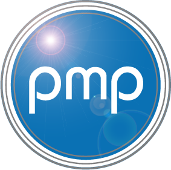

# PMP Solutions Website

<div align="center">
  
  
  [](https://nextjs.org/)
  [](https://www.typescriptlang.org/)
  [](https://www.prisma.io/)
  [](https://www.mysql.com/)
</div>

## 🌟 Features

- **Modern Stack**: Built with Next.js 13, TypeScript, and Prisma
- **Responsive Design**: Fully responsive layout for all devices
- **Content Management**: Admin panel for article management
- **Newsletter System**: Integrated newsletter subscription and sending
- **Image Management**: Support for article images with positioning
- **Rich Text Editor**: TinyMCE integration for article content
- **Authentication**: Secure admin access

## 🚀 Getting Started

### Prerequisites

- Node.js 16.x or later
- MySQL 8.0
- npm or yarn

### Installation

1. Clone the repository:

```bash
git clone https://github.com/17Sx/pmp-sv.git
cd pmp-sv
```

2. Install dependencies:

```bash
npm install
# or
yarn install
```

3. Set up environment variables:

```bash
cp .env.example .env
# Edit .env with your configuration
```

4. Initialize the database:

```bash
npx prisma migrate dev
```

5. Start the development server:

```bash
npm run dev
# or
yarn dev
```

## 📦 Project Structure

```
pmp-sv/
├── app/                    # Next.js app directory
│   ├── admin/             # Admin panel
│   ├── api/               # API routes
│   ├── articles/          # Article pages
│   └── components/        # React components
├── lib/                   # Utility functions
├── prisma/                # Database schema
└── public/                # Static assets
```

## 🔧 Configuration

### Environment Variables

```env
# Database
DB_HOST=localhost
DB_PORT=3310
DB_USER=root
DB_PASSWORD=your_password
DB_NAME=pmpwebsite

# NextAuth
NEXTAUTH_SECRET=your_secret
NEXTAUTH_URL=http://localhost:3000

# SMTP
SMTP_HOST=your_smtp_host
SMTP_PORT=25
SMTP_USER=your_smtp_user
SMTP_PASSWORD=your_smtp_password
SMTP_SENDER=no-reply@yourdomain.com

# TinyMCE
NEXT_PUBLIC_TINYMCE_API_KEY=your_api_key #important!
```

## 📝 Usage

### Admin Panel

Access the admin panel at `/admin` after logging in. Features include:

- Article creation and editing
- Newsletter management
- Image upload and positioning

### Newsletter System

- Subscribers can sign up through the website
- Articles can be sent as newsletters
- Unsubscribe functionality included

---

# 🇫🇷 PMP Solutions Website (Version Française)

<div align="center">
  
  
  [](https://nextjs.org/)
  [](https://www.typescriptlang.org/)
  [](https://www.prisma.io/)
  [](https://www.mysql.com/)
</div>

## 🌟 Fonctionnalités

- **Stack Moderne** : Construit avec Next.js 13, TypeScript et Prisma
- **Design Responsive** : Interface adaptative pour tous les appareils
- **Gestion de Contenu** : Panneau d'administration pour la gestion des articles
- **Système de Newsletter** : Abonnement et envoi de newsletters intégrés
- **Gestion des Images** : Support des images d'articles avec positionnement
- **Éditeur de Texte Riche** : Intégration de TinyMCE pour le contenu des articles
- **Authentification** : Accès sécurisé à l'administration

## 🚀 Démarrage

### Prérequis

- Node.js 16.x ou supérieur
- MySQL 8.0
- npm ou yarn

### Installation

1. Cloner le dépôt :

```bash
git clone https://github.com/17Sx/pmp-sv.git
cd pmp-sv
```

2. Installer les dépendances :

```bash
npm install
# ou
yarn install
```

3. Configurer les variables d'environnement :

```bash
cp .env.example .env
# Modifier .env avec votre configuration
```

4. Initialiser la base de données :

```bash
npx prisma migrate dev
```

5. Démarrer le serveur de développement :

```bash
npm run dev
# ou
yarn dev
```

## 📦 Structure du Projet

```
pmp-sv/
├── app/                    # Répertoire de l'application Next.js
│   ├── admin/             # Panneau d'administration
│   ├── api/               # Routes API
│   ├── articles/          # Pages d'articles
│   └── components/        # Composants React
├── lib/                   # Fonctions utilitaires
├── prisma/                # Schéma de base de données
└── public/                # Ressources statiques
```

## 🔧 Configuration

### Variables d'Environnement

```env
# Base de données
DB_HOST=localhost
DB_PORT=3310
DB_USER=root
DB_PASSWORD=votre_mot_de_passe
DB_NAME=pmpwebsite

# NextAuth
NEXTAUTH_SECRET=votre_secret
NEXTAUTH_URL=http://localhost:3000

# SMTP
SMTP_HOST=votre_hote_smtp
SMTP_PORT=25
SMTP_USER=votre_utilisateur_smtp
SMTP_PASSWORD=votre_mot_de_passe_smtp
SMTP_SENDER=no-reply@votredomaine.com

# TinyMCE
NEXT_PUBLIC_TINYMCE_API_KEY=votre_cle_api #important!
```

## 📝 Utilisation

### Panneau d'Administration

Accédez au panneau d'administration via `/admin` après connexion. Fonctionnalités incluses :

- Création et édition d'articles
- Gestion des newsletters
- Upload et positionnement d'images

### Système de Newsletter

- Les utilisateurs peuvent s'abonner via le site web
- Les articles peuvent être envoyés en newsletter
- Fonctionnalité de désabonnement incluse

---

<div align="center">
  Made with ❤️ by 17Sx
</div>
